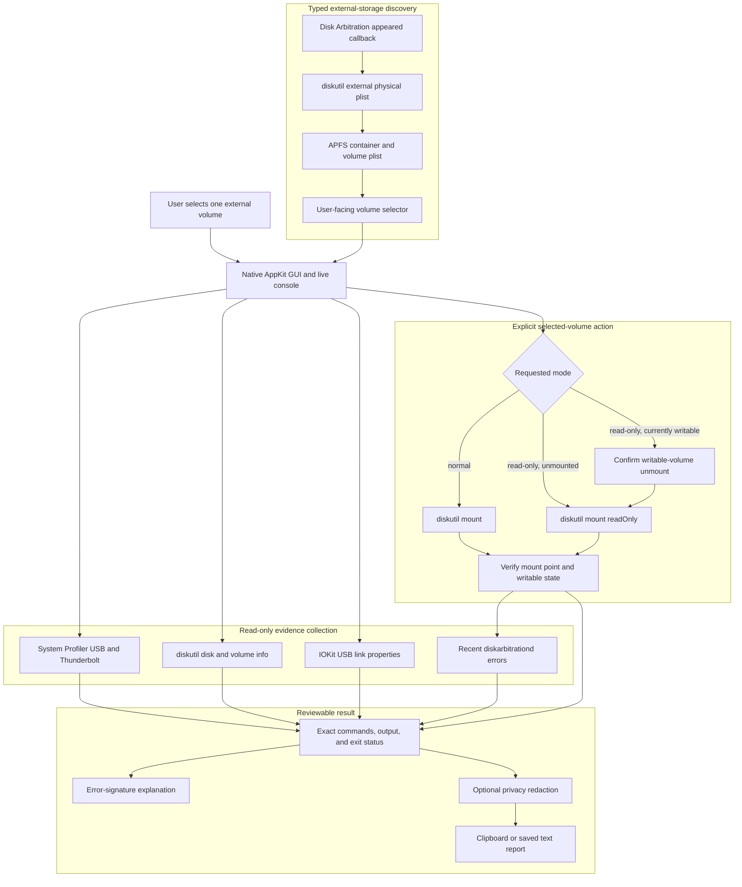

# Volume Mount Troubleshooter — macOS External Disk Diagnostics

### Transparent, non-destructive volume detection and mounting for Apple Silicon Macs


> **Scope:** Volume Mount Troubleshooter is a native macOS utility for identifying attached external storage, selecting one user-facing volume, inspecting the hardware and filesystem path, and requesting a normal or read-only mount. It does not erase, partition, format, repair, force-eject, unlock encrypted storage, collect credentials, or prove that a disk is healthy. Every operational command and exit status is visible in the built-in console.

---

## Table of Contents

- [Overview](#overview)
- [Screenshots](#screenshots)
- [Executive Summary](#executive-summary)
- [Safety Interpretation](#safety-interpretation)
- [Architecture](#architecture)
- [Requirements](#requirements)
- [Quick Start](#quick-start)
- [Using the Application](#using-the-application)
- [Volume Discovery and Selection](#volume-discovery-and-selection)
- [Normal and Read-Only Mounting](#normal-and-read-only-mounting)
- [Encryption Boundary](#encryption-boundary)
- [Hardware, SMART, and USB Evidence](#hardware-smart-and-usb-evidence)
- [Disk Arbitration Monitoring](#disk-arbitration-monitoring)
- [Safe Eject](#safe-eject)
- [Command Reference](#command-reference)
- [Direct Observation vs. Interpretation](#direct-observation-vs-interpretation)
- [Errors and Guided Explanations](#errors-and-guided-explanations)
- [Privacy and Report Redaction](#privacy-and-report-redaction)
- [Development and Testing](#development-and-testing)
- [Repository Layout](#repository-layout)
- [Current Limitations](#current-limitations)
- [Troubleshooting](#troubleshooting)
- [Uninstall](#uninstall)
- [Responsible Use](#responsible-use)
- [Project Status and License](#project-status-and-license)

---

## Overview

Volume Mount Troubleshooter turns the normal macOS storage-diagnostic workflow into a small native GUI. The application discovers external physical disks through `diskutil`, resolves APFS containers into user-facing volumes, and presents a selector rather than issuing a mount request against every connected disk.

When **Start** is pressed, the app displays each command as it runs and preserves:

- the exact executable and arguments;
- combined command output;
- the process exit status;
- the selected physical disk and volume identifiers;
- the requested mount mode;
- encryption and locked state;
- SMART availability and USB link information;
- mount-point and writable-state verification;
- recent Disk Arbitration errors and faults; and
- a bounded explanation tied to the observed error text.

The app uses only Apple frameworks and fixed Apple command-line tools. It has no package-manager dependencies and makes no network requests.

---

## Screenshots

### Main window


The main window keeps selection, mount mode, privacy controls, current status, actions, and the live command console in one view.

### Volume selector


The selector shows one entry per user-facing volume, including the current device identifier, filesystem, mount state, and encryption state. Device identifiers are transient and are rediscovered on refresh.

---

## Executive Summary

Volume Mount Troubleshooter currently provides:

- a selector containing one entry per user-facing external volume;
- typed parsing of `diskutil` and APFS property-list output;
- exclusion of APFS Preboot, Recovery, VM, Update, xART, and Hardware helper volumes;
- read-only mounting enabled by default;
- a confirmation boundary before unmounting a writable volume for read-only remounting;
- APFS/FileVault encryption and locked-state detection without password handling;
- SMART status reporting without treating `Not Supported` as a healthy result;
- USB negotiated-link-rate extraction from IOKit when available;
- recent `diskarbitrationd` error and fault collection;
- native Disk Arbitration notification handling for newly attached devices;
- exact post-mount verification of mount point and writable state;
- guided explanations for common mount and eject failures;
- confirmed whole-disk Safe Eject;
- privacy-redacted clipboard and saved reports; and
- a terminal-style live console with Stop, Copy Report, Save Report, and Show Volumes controls.

### Operational interpretation

| Observation | What the app concludes | What the app does not conclude |
|---|---|---|
| System Profiler lists a device | The selected hardware data type reported the device. | macOS created a mountable block device. |
| `diskutil` lists an external physical disk | Disk Arbitration published the device as external storage. | Every partition contains a supported or healthy filesystem. |
| SMART reports `Verified` | The transport returned that SMART status. | The disk cannot fail or contains no latent errors. |
| SMART reports `Not Supported` | SMART was unavailable through the current path. | The disk is healthy or unhealthy. |
| IOKit reports `10.0 Gb/s` | The USB link negotiated that signaling rate. | The filesystem or SSD will transfer data at 10 Gb/s. |
| A volume is encrypted and locked | macOS reports an encryption boundary that blocks mounting. | The volume is damaged or unauthorized. |
| `diskutil mount` exits successfully | The mount request returned success. | The requested state is accepted until the mount point and writable state are verified. |

---

## Safety Interpretation

The app separates inspection, mounting, and whole-device ejection.

| Action | Target | State change | Confirmation |
|---|---|---:|---:|
| Refresh or automatic detection | External disk metadata | None | No |
| Start diagnostics | Selected disk and volume | None until mount stage | No |
| Normal mount | Selected volume only | Mounts the volume | Start button |
| Read-only mount of an unmounted volume | Selected volume only | Mounts read-only | Start button |
| Read-only remount of a writable mounted volume | Selected volume only | Unmounts, then mounts read-only | Additional warning dialog |
| Safe Eject | Selected volume's whole physical disk | Ejects the disk and sibling volumes | Additional warning dialog |
| Save Report | User-selected destination | Writes one text report | Standard save dialog |

The application never constructs or runs repair, erase, partition, format, force-eject, unlock, or `sudo` commands. A failed mount remains a failure with its original output visible; the app does not silently switch to a different mode.

---

## Architecture



`DiskScanner` accepts only typed property-list structures with required identifiers. Additive unrelated fields are ignored, while missing required fields or malformed output produce explicit errors.

---

## Requirements

- macOS 13 or newer;
- an Apple Silicon Mac (`arm64`);
- Xcode or the Xcode command-line tools for building;
- a standard signed-in user account; and
- an external storage device visible to macOS.

No Homebrew packages, third-party frameworks, network services, kernel extensions, launch agents, launch daemons, or administrator privileges are required.

---

## Quick Start

Clone and build from source:

```sh
git clone https://github.com/hideouts-io/VolumeMountTroubleshooter.git
cd VolumeMountTroubleshooter
chmod +x build.sh
./build.sh
open "build/Volume Mount Troubleshooter.app"
```

The build script:

1. creates the `.app` bundle under `build/`;
2. compiles the Swift sources for Apple Silicon and macOS 13+;
3. links AppKit and Disk Arbitration;
4. runs the built-in parser and privacy-redaction self-test;
5. applies an ad-hoc code signature; and
6. verifies the bundle with strict code-signature validation.

The generated application is:

```text
build/Volume Mount Troubleshooter.app
```

---

## Using the Application

1. Attach the external disk.
2. Wait for the selector to refresh, or press **Refresh**.
3. Choose one user-facing volume.
4. Review its current mount, encryption, size, transport, SMART, and APFS-role summary.
5. Leave **Mount read-only** enabled for read-only access, or disable it for a normal mount request.
6. Press **Start**.
7. Review the exact commands, output, exit statuses, verification result, and any guided explanation.
8. Use **Show Volumes** to open `/Volumes` in Finder.
9. Use **Copy Report** or **Save Report…** to preserve the result.

The **Stop** button terminates the active command and cancels the remaining workflow. It does not continue to a mount after cancellation.

---

## Volume Discovery and Selection

Discovery begins with structured external-physical-disk inventory:

```sh
/usr/sbin/diskutil list -plist external physical
```

For each external physical disk, the app reads typed disk and partition information. If a partition is an APFS physical store, its synthesized container and volumes are resolved using:

```sh
/usr/sbin/diskutil apfs list -plist /dev/diskN
```

Only user-facing filesystems are selectable. APFS infrastructure roles such as Preboot, Recovery, VM, Update, xART, and Hardware are intentionally excluded. Microsoft Reserved partitions and partitions without a recognized filesystem are also excluded.

Disk identifiers are rediscovered on every refresh. The app does not assume identifiers such as `disk4s3` remain stable after reconnecting or restarting.

### Automatic detection

The app registers a native Disk Arbitration appeared callback. When macOS publishes a disk object, the callback schedules a fresh typed inventory after a short debounce interval.

Automatic detection refreshes the selector. It never automatically mounts, unmounts, unlocks, repairs, or ejects a device.

---

## Normal and Read-Only Mounting

### Normal mount

With **Mount read-only** disabled, the selected volume receives:

```sh
/usr/sbin/diskutil mount /dev/diskNsN
```

### Read-only mount

For an unmounted volume, read-only mode uses:

```sh
/usr/sbin/diskutil mount readOnly /dev/diskNsN
```

If the selected volume is already mounted writable, macOS cannot convert that live mount merely by repeating `mount readOnly`. The app displays a warning and, only after confirmation, runs:

```sh
/usr/sbin/diskutil unmount /dev/diskNsN
/usr/sbin/diskutil mount readOnly /dev/diskNsN
```

After either mode, the app decodes fresh `diskutil info -plist` output. Success requires a non-empty mount point. Read-only success additionally requires macOS to report that the mounted volume is not writable.

Read-only is a requested and verified mount property, not a guarantee that the underlying device received no writes before the app started. Hardware, firmware, filesystem checks performed elsewhere, and earlier mounts remain outside this app's control.

---

## Encryption Boundary

The scanner reads APFS and `diskutil` encryption metadata, including:

- APFS encryption state;
- FileVault state;
- locked or unlocked state; and
- the current mount point.

If the selected volume is encrypted and locked, the app stops before mounting and directs the user to Finder or Disk Utility. It does not invoke `diskutil apfs unlockVolume`, display a custom password field, read standard input, inspect the keychain, or store credentials.

An encrypted and unlocked volume may be mounted normally or read-only like any other selected volume.

---

## Hardware, SMART, and USB Evidence

### System Profiler

The app asks System Profiler for USB and Thunderbolt/USB4 attachment data:

```sh
/usr/sbin/system_profiler \
  SPUSBDataType \
  SPThunderboltDataType \
  -detailLevel mini
```

This is attachment-layer evidence only. Some USB storage paths may be present in `diskutil` and IOKit while absent from these System Profiler data types.

### SMART

SMART status comes from `diskutil info` for the selected volume's external whole disk. Many USB-to-storage bridges return `Not Supported`. The app reports that limitation rather than converting it into a passing health result.

### USB link speed

The app reads the IOUSB registry plane:

```sh
/usr/sbin/ioreg -p IOUSB -l -w0
```

When the selected product name can be associated with an `IOUSBHostDevice`, the app reports `UsbLinkSpeed` as the negotiated link rate. Full raw IOKit output is not placed in the console because it may contain hardware serial identifiers.

The reported link rate is not a benchmark. Cable quality, bridge behavior, queue depth, filesystem overhead, thermals, and the storage medium determine real transfer performance.

---

## Disk Arbitration Monitoring

After the mount attempt, the app requests error and fault entries emitted by `diskarbitrationd` during the previous 15 minutes:

```sh
/usr/bin/log show \
  --last 15m \
  --style compact \
  --predicate 'process == "diskarbitrationd" AND (messageType == error OR messageType == fault)'
```

An empty result means no matching retained error or fault entry was returned for that time window. It does not prove that no earlier failure occurred, that every storage event was logged, or that the filesystem is healthy.

---

## Safe Eject

**Safe Eject…** targets the whole external physical disk associated with the selected volume:

```sh
/usr/sbin/diskutil eject /dev/diskN
```

The app warns that sibling volumes on the same physical disk are included. It does not use `force`, and it preserves `Resource busy` or other failures rather than masking them.

Safe Eject should be used only after closing files and applications that are using every volume on that disk.

---

## Command Reference

The application constructs commands only from fixed absolute executable paths, fixed arguments, and typed disk identifiers returned by macOS.

| Purpose | Command |
|---|---|
| Attachment inventory | `/usr/sbin/system_profiler SPUSBDataType SPThunderboltDataType -detailLevel mini` |
| External disk display | `/usr/sbin/diskutil list external physical` |
| Typed external disk inventory | `/usr/sbin/diskutil list -plist external physical` |
| Disk or volume details | `/usr/sbin/diskutil info /dev/diskN` |
| Typed disk or volume details | `/usr/sbin/diskutil info -plist /dev/diskNsN` |
| Typed APFS inventory | `/usr/sbin/diskutil apfs list -plist /dev/diskN` |
| USB registry evidence | `/usr/sbin/ioreg -p IOUSB -l -w0` |
| Recent Disk Arbitration errors | `/usr/bin/log show --last 15m ...` |
| Selected-volume unmount | `/usr/sbin/diskutil unmount /dev/diskNsN` |
| Selected-volume read-only mount | `/usr/sbin/diskutil mount readOnly /dev/diskNsN` |
| Selected-volume normal mount | `/usr/sbin/diskutil mount /dev/diskNsN` |
| Whole external disk eject | `/usr/sbin/diskutil eject /dev/diskN` |

No user-entered text is interpolated into a shell command. `Process` receives the executable path and argument array directly.

---

## Direct Observation vs. Interpretation

The app keeps raw command evidence and guided interpretation separate.

### Direct observations

- exact command and argument rendering;
- command output and exit status;
- typed disk, partition, APFS-container, and APFS-volume fields;
- mount point and writable-volume state;
- encryption, FileVault, and locked fields;
- SMART status returned through the current storage path;
- IOKit USB link properties; and
- recent retained Disk Arbitration error and fault entries.

### Derived interpretations

- helper APFS roles are excluded from the selector;
- a selected volume is labeled mounted or unmounted;
- encryption fields are summarized as unencrypted, encrypted/unlocked, or encrypted/locked;
- IOKit link bits per second are formatted as Mb/s or Gb/s;
- a mount is accepted only after post-command verification; and
- known error-text signatures select bounded troubleshooting guidance.

### Not established

- physical disk health beyond the returned SMART field;
- filesystem integrity;
- data recoverability;
- authorization to access encrypted contents;
- absence of prior unsafe removal or write activity;
- real storage throughput;
- completeness of Unified Log retention; or
- safety of running repair tools.

---

## Errors and Guided Explanations

The console always retains the exact error and exit status. Guided text is added only after matching the observed result.

| Matched evidence | Guidance |
|---|---|
| Encrypted or locked | Unlock through Finder or Disk Utility; no credentials are collected by this app. |
| `Resource busy` or `in use` | Close files and applications; do not force-eject. |
| Missing or disappeared device | Refresh because the disk identifier may have changed. |
| Unsupported or unrecognized filesystem | Preserve the device and inspect it before any erase or repair. |
| `fsck` or filesystem check active | Wait for the active check; the app does not start a repair. |
| Permission or authorization denial | Use Finder or Disk Utility so macOS can present its native authorization UI. |
| Read-only or write-protected media | Read-only access may work; writable mounting is unavailable. |
| Exit status `0` without verified mount state | Treat the result as failed verification and review `diskutil` plus Disk Arbitration evidence. |
| No known signature | Preserve the exact output as authoritative evidence; no speculative cause is substituted. |

Command-launch failures, malformed property lists, missing required fields, cancellation, and report-write errors are all surfaced explicitly.

---

## Privacy and Report Redaction

**Redact shared reports** is enabled by default. Copying or saving then redacts:

- the signed-in username within `/Users/...` paths;
- USB and storage serial-number fields;
- IOKit session identifiers;
- hardware UIDs;
- disk and volume UUID fields; and
- UUID-shaped values elsewhere in the report.

Redaction applies to the copied or saved report. The live console remains diagnostic evidence and may still contain volume names, mount points, device identifiers, filenames emitted by macOS, and log metadata. Review every report before sharing it.

Disabling report redaction is an explicit user choice. Reports are written only to the destination selected in the standard macOS save panel.

The app does not transmit reports, telemetry, disk metadata, or credentials over the network.

---

## Development and Testing

### Build, self-test, sign, and verify

```sh
./build.sh
```

The build script automatically runs:

```sh
"build/Volume Mount Troubleshooter.app/Contents/MacOS/VolumeMountTroubleshooter" \
  --self-test
```

The self-test covers:

- strict property-list decoding;
- USB link-speed extraction; and
- privacy redaction of serial numbers and UUIDs.

### Live read-only scanner integration test

```sh
"build/Volume Mount Troubleshooter.app/Contents/MacOS/VolumeMountTroubleshooter" \
  --scan-test
```

This test inventories attached external disks, parses user-facing volumes, and reports SMART, USB, mount, and encryption metadata. It does not mount, unmount, repair, erase, or eject anything.

### Manual verification

```sh
/usr/bin/plutil -lint Info.plist
/usr/bin/codesign --verify --deep --strict --verbose=2 \
  "build/Volume Mount Troubleshooter.app"
```

Read-only mount, writable-volume unmount/remount, Safe Eject, and physical hot-plug behavior require deliberate testing with a disposable external test device. Do not validate those state-changing paths against irreplaceable evidence media.

---

## Repository Layout

```text
VolumeMountTroubleshooter/
├── AppDelegate.swift       # AppKit window, controls, actions, and workflow
├── Diagnostics.swift       # Typed models, plist decoding, redaction, guidance
├── SystemConnectors.swift  # Process, disk scanner, Disk Arbitration monitor
├── main.swift              # Application entry point and test modes
├── Info.plist              # macOS bundle metadata
├── build.sh                # Build, self-test, signing, and verification
├── README.md               # Project documentation
└── .gitignore              # Excludes generated build output
```

Generated applications under `build/` are intentionally not tracked by Git.

---

## Current Limitations

- The build script currently targets Apple Silicon only.
- The app is ad-hoc signed, not Developer ID signed, notarized, or distributed as a DMG or installer package.
- Only external physical storage published by `diskutil` is considered. Internal disks, disk images, network shares, and cloud-storage providers are outside scope.
- System Profiler may omit a connected USB device even when `diskutil` and IOKit report it.
- SMART is frequently unavailable through USB bridges.
- USB link speed is not storage throughput.
- Locked encrypted volumes must be unlocked outside the app.
- The app does not identify or install third-party filesystem drivers.
- The app does not repair filesystems or evaluate whether repair is safe.
- Unified Log results depend on retention, privacy redaction, and the selected 15-minute window.
- Automatic detection reacts to Disk Arbitration appeared events but does not auto-mount.
- Read-only guarantees begin only after the app verifies the requested read-only mount state.
- The repository does not currently include a declared software license.

---

## Troubleshooting

### No volume appears in the selector

Run the same layers manually:

```sh
/usr/sbin/system_profiler SPUSBDataType SPThunderboltDataType -detailLevel mini
/usr/sbin/diskutil list external physical
/usr/sbin/ioreg -r -c IOBlockStorageDevice -l -w0
```

- If no layer sees the device, check the cable, enclosure, adapter, hub power, and port.
- If System Profiler sees hardware but `diskutil` does not, macOS has not published a usable external disk.
- If `diskutil` sees the disk but the selector is empty, the disk may lack a recognized user-facing filesystem or may contain only excluded helper partitions.

### The volume is locked

Unlock it through Finder or Disk Utility, then press **Refresh**. Do not send a password or recovery key to this application or include one in a report.

### Read-only remount fails with `Resource busy`

Close Finder windows, Terminal working directories, documents, media applications, backup tools, indexing jobs, and any process using the selected mount point. Retry without force-unmounting.

### The mount command succeeds but verification fails

Treat the operation as unsuccessful. Review the fresh `diskutil info -plist` result and recent Disk Arbitration errors. Disk identifiers may also have changed during reconnect or device reset.

### SMART says `Not Supported`

That result is common through USB bridges and does not establish health. Use hardware-appropriate vendor diagnostics or a direct interface when health assessment is required.

---

## Uninstall

The app installs no background service or privileged helper. Quit it and remove the generated bundle:

```sh
rm -rf "build/Volume Mount Troubleshooter.app"
```

Delete the cloned repository separately if the source is no longer needed. Saved reports remain wherever the user chose to write them.

---

## Responsible Use

Use Volume Mount Troubleshooter only with storage you own or are authorized to examine. Mounting can expose private data to applications running under the signed-in account. Ejecting a disk affects every sibling volume on that physical device.

For forensic evidence, prefer a validated hardware write blocker and an evidence-handling procedure appropriate to the investigation. A software read-only mount is useful operational protection, but it is not a substitute for hardware-enforced write blocking, acquisition hashes, chain of custody, or verified forensic tooling.

Preserve original error output before attempting repair. Never erase or format a device merely because macOS cannot mount it.

---

## Project Status and License

Volume Mount Troubleshooter is an early native macOS utility. The source, parser self-test, live read-only scanner test, ad-hoc application build, and strict signature verification are available in this repository.

The project currently has no third-party runtime dependencies, no telemetry, no network access, and no privileged helper.

No software license has been declared in the repository. Until a license is added, copyright law reserves reuse and redistribution rights to the copyright holder.
