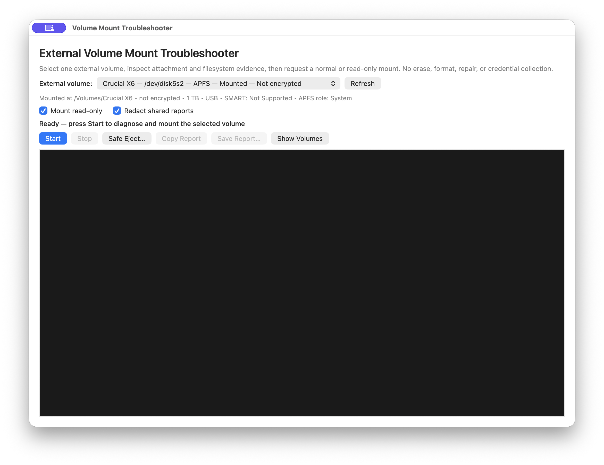
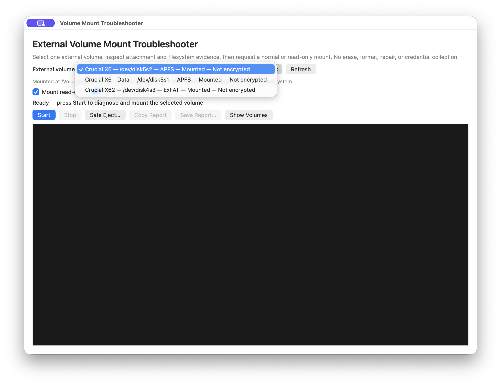
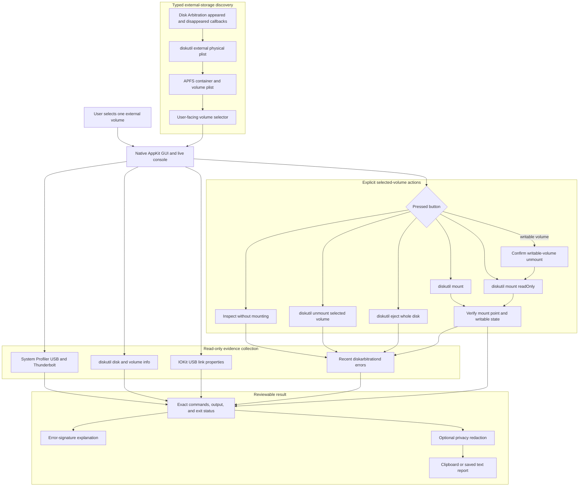

# Volume Mount Troubleshooter — macOS External Disk Diagnostics

### Transparent, non-destructive volume detection and mounting for Intel and Apple Silicon Macs

<p align="center">
  
</p>


[](https://github.com/hideouts-io/VolumeMountTroubleshooter/actions/workflows/macos-ci.yml)

> **Scope:** Volume Mount Troubleshooter is a native macOS utility for identifying attached external storage, selecting one user-facing volume, and explicitly inspecting, mounting, unmounting, or safely ejecting it. It does not erase, partition, format, repair, force-eject, unlock encrypted storage, collect credentials, or prove that a disk is healthy. Every operational command and exit status is visible in the built-in console.

---

## Table of Contents

- [Overview](#overview)
- [Screenshots](#screenshots)
- [Executive Summary](#executive-summary)
- [Safety Interpretation](#safety-interpretation)
- [Architecture](#architecture)
- [Requirements](#requirements)
- [Quick Start](#quick-start)
- [Using the Application](#using-the-application)
- [Volume Discovery and Selection](#volume-discovery-and-selection)
- [Normal and Read-Only Mounting](#normal-and-read-only-mounting)
- [Encryption Boundary](#encryption-boundary)
- [Hardware, SMART, and USB Evidence](#hardware-smart-and-usb-evidence)
- [Disk Arbitration Monitoring](#disk-arbitration-monitoring)
- [Safe Eject](#safe-eject)
- [Command Reference](#command-reference)
- [Direct Observation vs. Interpretation](#direct-observation-vs-interpretation)
- [Errors and Guided Explanations](#errors-and-guided-explanations)
- [Privacy and Report Redaction](#privacy-and-report-redaction)
- [Development and Testing](#development-and-testing)
- [Repository Layout](#repository-layout)
- [Current Limitations](#current-limitations)
- [Troubleshooting](#troubleshooting)
- [Uninstall](#uninstall)
- [Responsible Use](#responsible-use)
- [Project Status and License](#project-status-and-license)

---

## Overview

Volume Mount Troubleshooter turns the normal macOS storage-diagnostic workflow into a small native GUI. The application discovers external physical disks through `diskutil`, resolves APFS containers into user-facing volumes, and presents a selector rather than issuing a mount request against every connected disk.

When an explicit action is pressed, the app displays each command as it runs and preserves:

- the exact executable and arguments;
- combined command output;
- the process exit status;
- the selected physical disk and volume identifiers;
- the selected action;
- encryption and locked state;
- overall SMART status, optional detailed health counters, and USB link information;
- mount-point and writable-state verification;
- recent Disk Arbitration errors and faults; and
- a bounded explanation tied to the observed error text.

The app uses only Apple frameworks and fixed Apple command-line tools for its required functionality. It has no required package-manager dependencies and makes no network requests. If an existing `smartctl` installation is found at a known fixed path, the app can read additional health counters without installing or updating anything.

---

## Screenshots

### Main window



The main window keeps selection, explicit actions, privacy controls, current status, and the live command console in one view.

### Volume selector



The selector shows one entry per user-facing volume, including the current device identifier, filesystem, mount state, and encryption state. Device identifiers are transient and are rediscovered on refresh.

---

## Executive Summary

Volume Mount Troubleshooter currently provides:

- a selector containing one entry per user-facing external volume;
- typed parsing of `diskutil` and APFS property-list output;
- per-disk failure isolation that preserves exact errors while retaining usable volumes from other disks;
- exclusion of APFS Preboot, Recovery, VM, Update, xART, and Hardware helper volumes;
- explicit Inspect, Mount Read-Only, Mount Normally, Unmount Volume, and Safe Eject Disk controls;
- a confirmation boundary before unmounting a writable volume for read-only remounting;
- APFS/FileVault encryption and locked-state detection without password handling;
- bounded unlock-transition retries with visible progress and hardware-path matching;
- Finder-only reveal for mounted vendor unlocker volumes without launching their applications;
- SMART status plus optional temperature, media-error, unsafe-shutdown, power-on-hour, and percentage-used reporting;
- USB negotiated-link-rate extraction from IOKit when available;
- recent `diskarbitrationd` error and fault collection;
- native Disk Arbitration notification handling for attached and disconnected devices, including immediate stale-selector removal;
- exact post-mount verification of mount point and writable state;
- guided explanations for common mount and eject failures;
- confirmed whole-disk Safe Eject;
- privacy-redacted clipboard and saved reports; and
- a terminal-style live console with Stop, Copy Report, Save Report, and Show Volumes controls.

### Operational interpretation

| Observation | What the app concludes | What the app does not conclude |
|---|---|---|
| System Profiler lists a device | The selected hardware data type reported the device. | macOS created a mountable block device. |
| `diskutil` lists an external physical disk | Disk Arbitration published the device as external storage. | Every partition contains a supported or healthy filesystem. |
| SMART reports `Verified` | The transport returned that SMART status. | The disk cannot fail or contains no latent errors. |
| SMART reports `Not Supported` | SMART was unavailable through the current path. | The disk is healthy or unhealthy. |
| IOKit reports `10.0 Gb/s` | The USB link negotiated that signaling rate. | The filesystem or SSD will transfer data at 10 Gb/s. |
| A volume is encrypted and locked | macOS reports an encryption boundary that blocks mounting. | The volume is damaged or unauthorized. |
| `diskutil mount` exits successfully | The mount request returned success. | The requested state is accepted until the mount point and writable state are verified. |

---

## Safety Interpretation

The app separates inspection, mounting, and whole-device ejection.

| Action | Target | State change | Confirmation |
|---|---|---:|---:|
| Refresh or automatic detection | External disk metadata | None | No |
| Inspect | Selected disk and volume | None | No |
| Mount Normally | Selected volume only | Mounts the volume | Explicit button |
| Mount Read-Only on an unmounted volume | Selected volume only | Mounts read-only | Explicit button |
| Read-only remount of a writable mounted volume | Selected volume only | Unmounts, then mounts read-only | Additional warning dialog |
| Unmount Volume | Selected volume only | Unmounts only that volume | Explicit button |
| Safe Eject Disk | Selected volume's whole physical disk | Ejects the disk and sibling volumes | Additional warning dialog |
| Save Report | User-selected destination | Writes one text report | Standard save dialog |

The application never constructs or runs repair, erase, partition, format, force-eject, unlock, or `sudo` commands. A failed mount remains a failure with its original output visible; the app does not silently switch to a different mode.

---

## Architecture



`DiskScanner` accepts only typed property-list structures with required identifiers. Additive unrelated fields are ignored, while missing required fields or malformed output produce explicit errors.

---

## Requirements

- macOS 13 or newer;
- an Apple Silicon (`arm64`) or Intel (`x86_64`) Mac;
- Xcode or the Xcode command-line tools for building;
- a standard signed-in user account; and
- an external storage device visible to macOS.

No Homebrew packages, third-party frameworks, network services, kernel extensions, launch agents, launch daemons, or administrator privileges are required. The optional expanded SMART display uses an existing `smartctl` executable when available; it is not required for volume discovery, inspection, mounting, unmounting, or ejection.

---

## Quick Start

Clone and build from source:

```sh
git clone https://github.com/hideouts-io/VolumeMountTroubleshooter.git
cd VolumeMountTroubleshooter
chmod +x build.sh
./build.sh
open "build/Volume Mount Troubleshooter.app"
```

The build script:

1. creates the `.app` bundle under `build/`;
2. compiles separate `arm64` and `x86_64` slices for macOS 13+;
3. combines the slices into one universal executable with Apple `lipo`;
4. verifies that both architectures are present;
5. links AppKit and Disk Arbitration;
6. runs the built-in parser and privacy-redaction self-test;
7. applies an ad-hoc code signature to the completed universal bundle; and
8. verifies the bundle with strict code-signature validation.

The generated application is:

```text
build/Volume Mount Troubleshooter.app
```

The historical v0.2 `macos-arm64` release asset remains Apple-Silicon-only. The v0.3.0 release is universal when its filename ends in `macOS-universal.zip` and its checksum matches the accompanying `SHA256SUMS.txt` file.

---

## Using the Application

1. Attach the external disk.
2. Wait for the selector to refresh, or press **Refresh**.
3. Choose one user-facing volume.
4. Review its current mount, encryption, size, transport, SMART, and APFS-role summary.
5. Press exactly one action: **Inspect**, **Mount Read-Only**, **Mount Normally**, **Unmount Volume**, or **Safe Eject Disk**.
6. Review the exact commands, output, exit statuses, verification result, and any guided explanation.
7. Use **Show Volumes** to open `/Volumes` in Finder.
8. Use **Copy Report** or **Save Report…** to preserve the result.

**Inspect** is the Return-key default and never mounts or unmounts the volume. The **Stop** button terminates the active command and cancels the remaining workflow. It does not continue to a state-changing command after cancellation.

---

## Volume Discovery and Selection

Discovery begins with structured external-physical-disk inventory:

```sh
/usr/sbin/diskutil list -plist external physical
```

For each external physical disk, the app reads typed disk and partition information. If a partition is an APFS physical store, its synthesized container and volumes are resolved using:

```sh
/usr/sbin/diskutil apfs list -plist /dev/diskN
```

Each physical disk is scanned within its own failure boundary. If `diskutil info`, partition decoding, or APFS discovery fails for one disk, the console records that disk identifier and the exact command error, exit status, and output. The selector still displays usable volumes discovered on other physical disks. Cancellation still stops the complete inventory, and failure of the initial external-disk list remains fatal because no reliable per-disk inventory exists in that case.

Only user-facing filesystems are selectable. APFS infrastructure roles such as Preboot, Recovery, VM, Update, xART, and Hardware are intentionally excluded. Microsoft Reserved partitions and partitions without a recognized filesystem are also excluded.

Disk identifiers are rediscovered on every refresh. The app does not assume identifiers such as `disk4s3` remain stable after reconnecting or restarting.

### Automatic detection

The app registers native Disk Arbitration appeared and disappeared callbacks. When macOS publishes a disk object, the appeared callback schedules a fresh typed inventory after a short debounce interval. When a disk disappears, the app immediately removes that device and its volumes from the in-memory snapshot and selector, clears a stale selection, and disables the action controls until the user deliberately selects another available volume. A follow-up inventory then reconciles the complete device list.

If a disk disappears while an inventory is already running, the app cancels and invalidates that inventory so its older result cannot restore the removed selector entry. It then performs one follow-up refresh. Storage inventory commands time out after 15 seconds so a vendor unlock transition cannot leave the selector waiting indefinitely.

When a virtual unlocker is present without its matching data disk, the app retries discovery five times at two-second intervals. The visible progression advances from **Unlocker detected** through **Waiting for data disk** to the discovered volume name, such as **Extreme SSD ready**. Association uses the shared macOS device-tree path rather than vendor names or transient `diskN` identifiers.

Automatic detection refreshes the selector. It never automatically mounts, unmounts, unlocks, repairs, or ejects a device.

---

## Normal and Read-Only Mounting

### Normal mount

**Mount Normally** is enabled only for an unlocked, unmounted selected volume and runs:

```sh
/usr/sbin/diskutil mount /dev/diskNsN
```

### Read-only mount

For an unlocked, unmounted selected volume, **Mount Read-Only** runs:

```sh
/usr/sbin/diskutil mount readOnly /dev/diskNsN
```

If the selected volume is already mounted writable, macOS cannot convert that live mount merely by repeating `mount readOnly`. The app displays a warning and, only after confirmation, runs:

```sh
/usr/sbin/diskutil unmount /dev/diskNsN
/usr/sbin/diskutil mount readOnly /dev/diskNsN
```

After either mode, the app decodes fresh `diskutil info -plist` output. Success requires a non-empty mount point. Read-only success additionally requires macOS to report that the mounted volume is not writable.

**Unmount Volume** is enabled only while the selected volume is mounted and targets that volume alone:

```sh
/usr/sbin/diskutil unmount /dev/diskNsN
```

Read-only is a requested and verified mount property, not a guarantee that the underlying device received no writes before the app started. Hardware, firmware, filesystem checks performed elsewhere, and earlier mounts remain outside this app's control.

---

## Encryption Boundary

The scanner reads APFS and `diskutil` encryption metadata, including:

- APFS encryption state;
- FileVault state;
- locked or unlocked state; and
- the current mount point.

If the selected volume is encrypted and locked, the app stops before mounting and directs the user to Finder or Disk Utility. It does not invoke `diskutil apfs unlockVolume`, display a custom password field, read standard input, inspect the keychain, or store credentials.

Some hardware-encrypted external drives first expose a small read-only virtual CD containing a vendor unlocker. The app excludes that helper media from the volume selector, explains that it is not the data volume, and waits for Disk Arbitration to publish the full-size unlocked disk. **Show Unlocker in Finder** reveals only the mounted helper directory; it does not open the vendor application, request credentials, or inspect their contents. Once the real filesystem appears, the existing normal or read-only selected-volume mount workflow applies.

An encrypted and unlocked volume may be mounted normally or read-only like any other selected volume.

---

## Hardware, SMART, and USB Evidence

### System Profiler

The app asks System Profiler for USB and Thunderbolt/USB4 attachment data:

```sh
/usr/sbin/system_profiler \
  SPUSBDataType \
  SPThunderboltDataType \
  -detailLevel mini
```

This is attachment-layer evidence only. Some USB storage paths may be present in `diskutil` and IOKit while absent from these System Profiler data types.

### SMART

SMART status comes from `diskutil info` for the selected volume's external whole disk. Many USB-to-storage bridges return `Not Supported`. The app reports that limitation rather than converting it into a passing health result.

For expanded health data, the app checks fixed locations for an existing `smartctl` executable and, when found, runs the read-only display command:

```sh
/opt/homebrew/sbin/smartctl --all --json /dev/diskN
```

The exact executable path may instead be `/usr/local/sbin`, `/usr/local/bin`, `/opt/local/sbin`, or a future bundled resource. The app does not search arbitrary `PATH` entries, install smartmontools, enable SMART, start tests, or change device settings. The `--all` and `--json` options request display-only health information in structured form.

The raw JSON is decoded but is not copied wholesale into the console because it can contain device model and serial identifiers. The app displays only the recognized health counters, collector path, and exit status; exported reports apply the existing privacy redaction rules.

When the device and bridge expose them, the app displays:

- current temperature in degrees Celsius;
- media and data-integrity error count;
- unsafe or unexpected shutdown count;
- power-on hours; and
- percentage used.

NVMe values come from the controller's SMART/Health Information log. The smartmontools implementation maps those counters to structured JSON fields such as `temperature.current`, `power_on_time.hours`, `percentage_used`, `unsafe_shutdowns`, and `media_errors`. ATA attribute names and raw values are vendor-specific, so the app recognizes only a conservative set of common names and labels them with a vendor-data caveat. [smartctl JSON implementation](https://www.smartmontools.org/static/doxygen/smartctl_8cpp_source.html), [NVMe JSON field mapping](https://www.smartmontools.org/static/doxygen/nvmeprint_8cpp_source.html)

Missing data is shown as unavailable, never as zero. A bridge may suppress, cache, translate, or mislabel drive data; percentage used is not the same as percentage remaining and may exceed 100 on an over-endurance NVMe device. These counters are evidence reported through the current drive/bridge path, not an independent health verdict.

### USB link speed

The app reads the IOUSB registry plane:

```sh
/usr/sbin/ioreg -p IOUSB -l -w0
```

When the selected product name can be associated with an `IOUSBHostDevice`, the app reports `UsbLinkSpeed` as the negotiated link rate. Full raw IOKit output is not placed in the console because it may contain hardware serial identifiers.

The reported link rate is not a benchmark. Cable quality, bridge behavior, queue depth, filesystem overhead, thermals, and the storage medium determine real transfer performance.

---

## Disk Arbitration Monitoring

After the mount attempt, the app requests error and fault entries emitted by `diskarbitrationd` during the previous 15 minutes:

```sh
/usr/bin/log show \
  --last 15m \
  --style compact \
  --predicate 'process == "diskarbitrationd" AND (messageType == error OR messageType == fault)'
```

An empty result means no matching retained error or fault entry was returned for that time window. It does not prove that no earlier failure occurred, that every storage event was logged, or that the filesystem is healthy.

---

## Safe Eject

**Safe Eject Disk** targets the whole external physical disk associated with the selected volume:

```sh
/usr/sbin/diskutil eject /dev/diskN
```

The app warns that sibling volumes on the same physical disk are included. It does not use `force`, and it preserves `Resource busy` or other failures rather than masking them.

Safe Eject should be used only after closing files and applications that are using every volume on that disk.

---

## Command Reference

The application constructs commands only from fixed absolute executable paths, fixed arguments, and typed disk identifiers returned by macOS.

| Purpose | Command |
|---|---|
| Attachment inventory | `/usr/sbin/system_profiler SPUSBDataType SPThunderboltDataType -detailLevel mini` |
| External disk display | `/usr/sbin/diskutil list external physical` |
| Typed external disk inventory | `/usr/sbin/diskutil list -plist external physical` |
| Disk or volume details | `/usr/sbin/diskutil info /dev/diskN` |
| Typed disk or volume details | `/usr/sbin/diskutil info -plist /dev/diskNsN` |
| Typed APFS inventory | `/usr/sbin/diskutil apfs list -plist /dev/diskN` |
| Optional expanded SMART JSON | `<known smartctl path> --all --json /dev/diskN` |
| USB registry evidence | `/usr/sbin/ioreg -p IOUSB -l -w0` |
| Recent Disk Arbitration errors | `/usr/bin/log show --last 15m ...` |
| Selected-volume unmount | `/usr/sbin/diskutil unmount /dev/diskNsN` |
| Selected-volume read-only mount | `/usr/sbin/diskutil mount readOnly /dev/diskNsN` |
| Selected-volume normal mount | `/usr/sbin/diskutil mount /dev/diskNsN` |
| Whole external disk eject | `/usr/sbin/diskutil eject /dev/diskN` |

No user-entered text is interpolated into a shell command. `Process` receives the executable path and argument array directly.

---

## Direct Observation vs. Interpretation

The app keeps raw command evidence and guided interpretation separate.

### Direct observations

- exact command and argument rendering;
- command output and exit status;
- typed disk, partition, APFS-container, and APFS-volume fields;
- mount point and writable-volume state;
- encryption, FileVault, and locked fields;
- overall SMART status and any detailed controller/vendor counters returned through the current storage path;
- IOKit USB link properties; and
- recent retained Disk Arbitration error and fault entries.

### Derived interpretations

- helper APFS roles are excluded from the selector;
- a selected volume is labeled mounted or unmounted;
- encryption fields are summarized as unencrypted, encrypted/unlocked, or encrypted/locked;
- IOKit link bits per second are formatted as Mb/s or Gb/s;
- a mount is accepted only after post-command verification; and
- known error-text signatures select bounded troubleshooting guidance.

### Not established

- physical disk health beyond the returned SMART and vendor/controller fields;
- filesystem integrity;
- data recoverability;
- authorization to access encrypted contents;
- absence of prior unsafe removal or write activity;
- real storage throughput;
- completeness of Unified Log retention; or
- safety of running repair tools.

---

## Errors and Guided Explanations

The console always retains the exact error and exit status. Guided text is added only after matching the observed result.

| Matched evidence | Guidance |
|---|---|
| Encrypted or locked | Unlock through Finder or Disk Utility; no credentials are collected by this app. |
| `Resource busy` or `in use` | Close files and applications; do not force-eject. |
| Missing or disappeared device | Refresh because the disk identifier may have changed. |
| Unsupported or unrecognized filesystem | Preserve the device and inspect it before any erase or repair. |
| `fsck` or filesystem check active | Wait for the active check; the app does not start a repair. |
| Permission or authorization denial | Use Finder or Disk Utility so macOS can present its native authorization UI. |
| Read-only or write-protected media | Read-only access may work; writable mounting is unavailable. |
| Exit status `0` without verified mount state | Treat the result as failed verification and review `diskutil` plus Disk Arbitration evidence. |
| No known signature | Preserve the exact output as authoritative evidence; no speculative cause is substituted. |

Command-launch failures, malformed property lists, missing required fields, cancellation, and report-write errors are all surfaced explicitly. A per-disk discovery failure produces a partial-inventory warning rather than discarding successfully decoded volumes from other disks.

---

## Privacy and Report Redaction

**Redact shared reports** is enabled by default. Copying or saving then redacts:

- the signed-in username within `/Users/...` paths;
- USB and storage serial-number fields;
- IOKit session identifiers;
- hardware UIDs;
- disk and volume UUID fields; and
- UUID-shaped values elsewhere in the report.

Redaction applies to the copied or saved report. The live console remains diagnostic evidence and may still contain volume names, mount points, device identifiers, filenames emitted by macOS, and log metadata. Review every report before sharing it.

Disabling report redaction is an explicit user choice. Reports are written only to the destination selected in the standard macOS save panel.

The app does not transmit reports, telemetry, disk metadata, or credentials over the network.

---

## Development and Testing

### Build, self-test, sign, and verify

```sh
./build.sh
```

The build script automatically runs:

```sh
"build/Volume Mount Troubleshooter.app/Contents/MacOS/VolumeMountTroubleshooter" \
  --self-test
```

The self-test covers:

- strict property-list decoding;
- nested virtual-CD partition discovery;
- unlocker-to-data-disk hardware-path association;
- unlock-transition progression messages and bounded command timeouts;
- disconnected whole-disk and child-volume snapshot removal;
- disk identifier descendant matching without prefix collisions;
- coexistence of usable volumes and exact per-disk scan failures;
- explicit-action availability for unmounted, writable-mounted, locked, and absent selections;
- standardized NVMe and conservative ATA expanded-SMART JSON parsing;
- USB link-speed extraction; and
- privacy redaction of serial numbers and UUIDs.

### Universal release archive and checksum

```sh
./script/build_release.sh
```

This produces two ignored files under `dist/`:

```text
VolumeMountTroubleshooter-vVERSION-macOS-universal.zip
VolumeMountTroubleshooter-vVERSION-SHA256SUMS.txt
```

The packaging script rebuilds the app, verifies its universal architecture set and strict ad-hoc signature, creates the ZIP, generates its SHA-256 checksum, extracts the ZIP into a temporary directory, re-verifies the signature and architectures, and runs the self-tests from the extracted bundle.

You can repeat the checksum verification with:

```sh
cd dist
shasum -a 256 -c VolumeMountTroubleshooter-v*-SHA256SUMS.txt
```

Ad-hoc signing detects accidental bundle changes but is not Developer ID signing or Apple notarization.

### GitHub Actions

The [`macOS CI` workflow](.github/workflows/macos-ci.yml) runs on every branch push, pull request, `v*` tag push, published release, and manual dispatch. It:

1. builds the universal app on GitHub's Apple Silicon `macos-15` runner;
2. runs self-tests and strict signature verification;
3. packages the app and produces a SHA-256 checksum;
4. uploads the ZIP and checksum as immutable workflow artifacts;
5. downloads that exact package on `macos-15-intel` and repeats checksum, architecture, signature, and native Intel self-test validation; and
6. attaches both verified files to an existing GitHub Release when that release is published.

A `v*` tag must exactly match `CFBundleShortVersionString`, such as tag `v0.3.0` for app version `0.3.0`, or the release workflow fails before packaging. GitHub documents `macos-15` as arm64 and `macos-15-intel` as Intel runner labels, while artifact uploads expose a SHA-256 digest in addition to the project's downloadable checksum file. [GitHub-hosted runner reference](https://docs.github.com/en/actions/how-tos/write-workflows/choose-where-workflows-run/choose-the-runner-for-a-job), [workflow artifact validation](https://docs.github.com/en/actions/tutorials/store-and-share-data)

### Live read-only scanner integration test

```sh
"build/Volume Mount Troubleshooter.app/Contents/MacOS/VolumeMountTroubleshooter" \
  --scan-test
```

This test inventories attached external disks, parses user-facing volumes, and reports overall and expanded SMART, USB, mount, and encryption metadata. It does not mount, unmount, repair, erase, or eject anything.

### Manual verification

```sh
/usr/bin/plutil -lint Info.plist
/usr/bin/codesign --verify --deep --strict --verbose=2 \
  "build/Volume Mount Troubleshooter.app"
```

Normal mount, read-only mount, explicit unmount, writable-volume unmount/remount, Safe Eject Disk, and physical hot-plug behavior require deliberate testing with a disposable external test device. Do not validate those state-changing paths against irreplaceable evidence media.

### Hardware test matrix

The [hardware test matrix](docs/HARDWARE_TEST_MATRIX.md) defines repeatable cases for unencrypted and encrypted APFS, ExFAT, NTFS, virtual unlockers, multiple disks with an isolated failure, disconnect-during-scan behavior, busy volumes, USB hubs, and verified read-only remounts. Each case records the exact build, macOS version, drive, bridge, connection path, expected result, observed result, and privacy-reviewed evidence.

Matrix rows remain `NOT RUN`, `BLOCKED`, `FAIL`, or `HISTORICAL` until the behavior is deliberately exercised on disposable hardware. A parser self-test, successful build, or unobserved field is never counted as hardware validation.

---

## Repository Layout

```text
VolumeMountTroubleshooter/
├── .github/workflows/macos-ci.yml # Universal build and release validation
├── AppDelegate.swift       # AppKit window, controls, actions, and workflow
├── assets/AppIcon.png      # Canonical project logo source
├── assets/AppIcon.icns     # Multi-resolution macOS application icon
├── Diagnostics.swift       # Typed models, plist decoding, redaction, guidance
├── docs/HARDWARE_TEST_MATRIX.md # Physical-device validation cases and records
├── SystemConnectors.swift  # Process, disk scanner, Disk Arbitration monitor
├── main.swift              # Application entry point and test modes
├── Info.plist              # macOS bundle metadata
├── build.sh                # Build, self-test, signing, and verification
├── script/build_release.sh # Universal ZIP and SHA-256 generation
├── script/build_and_run.sh # Build and launch entrypoint for local debugging
├── script/verify_release.sh # Extracted release and native-slice verification
├── README.md               # Project documentation
├── LICENSE                 # MIT software license
└── .gitignore              # Excludes generated build output
```

Generated applications under `build/` and release files under `dist/` are intentionally not tracked by Git.

---

## Current Limitations

- The app is ad-hoc signed, not Developer ID signed, notarized, or distributed as a DMG or installer package.
- Only external physical storage published by `diskutil` is considered. Internal disks, disk images, network shares, and cloud-storage providers are outside scope.
- System Profiler may omit a connected USB device even when `diskutil` and IOKit report it.
- SMART is frequently unavailable through USB bridges; expanded counters also require an existing compatible `smartctl` collector.
- USB link speed is not storage throughput.
- Locked encrypted volumes must be unlocked outside the app.
- The app does not identify or install third-party filesystem drivers.
- The app does not repair filesystems or evaluate whether repair is safe.
- Unified Log results depend on retention, privacy redaction, and the selected 15-minute window.
- Automatic detection reacts to Disk Arbitration appeared and disappeared events but does not auto-mount.
- Read-only guarantees begin only after the app verifies the requested read-only mount state.

---

## Troubleshooting

### No volume appears in the selector

Run the same layers manually:

```sh
/usr/sbin/system_profiler SPUSBDataType SPThunderboltDataType -detailLevel mini
/usr/sbin/diskutil list external physical
/usr/sbin/ioreg -r -c IOBlockStorageDevice -l -w0
```

- If no layer sees the device, check the cable, enclosure, adapter, hub power, and port.
- If System Profiler sees hardware but `diskutil` does not, macOS has not published a usable external disk.
- If `diskutil` sees the disk but the selector is empty, the disk may lack a recognized user-facing filesystem or may contain only excluded helper partitions.

### The volume is locked

Unlock it through Finder or Disk Utility, then press **Refresh**. Do not send a password or recovery key to this application or include one in a report.

### A SanDisk or Western Digital unlocker volume appears

The small read-only unlocker is a virtual CD, not the data filesystem. Use **Show Unlocker in Finder** if you need to locate it, then deliberately open the vendor utility yourself. Complete the vendor unlock and watch the five-attempt progress indicator until the full-size volume appears. Pressing **Refresh** restarts the retry budget; the app never launches the utility or submits, reads, or stores its password.

### Read-only remount fails with `Resource busy`

Close Finder windows, Terminal working directories, documents, media applications, backup tools, indexing jobs, and any process using the selected mount point. Retry without force-unmounting.

### The mount command succeeds but verification fails

Treat the operation as unsuccessful. Review the fresh `diskutil info -plist` result and recent Disk Arbitration errors. Disk identifiers may also have changed during reconnect or device reset.

### SMART says `Not Supported`

That result is common through USB bridges and does not establish health. Expanded counters may still be unavailable because the bridge blocks SMART pass-through, `smartctl` is absent, or the current user cannot access the health interface. The app reports the reason it observed without requesting administrator credentials. Use hardware-appropriate vendor diagnostics or a direct interface when health assessment is required.

---

## Uninstall

The app installs no background service or privileged helper. Quit it and remove the generated bundle:

```sh
rm -rf "build/Volume Mount Troubleshooter.app"
```

Delete the cloned repository separately if the source is no longer needed. Saved reports remain wherever the user chose to write them.

---

## Responsible Use

Use Volume Mount Troubleshooter only with storage you own or are authorized to examine. Mounting can expose private data to applications running under the signed-in account. Ejecting a disk affects every sibling volume on that physical device.

For forensic evidence, prefer a validated hardware write blocker and an evidence-handling procedure appropriate to the investigation. A software read-only mount is useful operational protection, but it is not a substitute for hardware-enforced write blocking, acquisition hashes, chain of custody, or verified forensic tooling.

Preserve original error output before attempting repair. Never erase or format a device merely because macOS cannot mount it.

---

## Project Status and License

Volume Mount Troubleshooter is an early native macOS utility. The source builds as one universal `arm64 + x86_64` app. Parser self-tests, a live read-only scanner test, deterministic ZIP and checksum generation, strict ad-hoc signature verification, and native CI validation on Apple Silicon and Intel runners are available in this repository.

The project has no required third-party runtime dependencies, no telemetry, no network access, and no privileged helper. Expanded SMART collection is an optional integration with an existing smartmontools installation and is not bundled by the current build.

Volume Mount Troubleshooter is released under the [MIT License](LICENSE). Anyone may freely use, copy, modify, merge, publish, distribute, sublicense, or sell copies of the software, including for commercial purposes, provided the copyright and license notice remain with copies or substantial portions. The software is provided without warranty.
